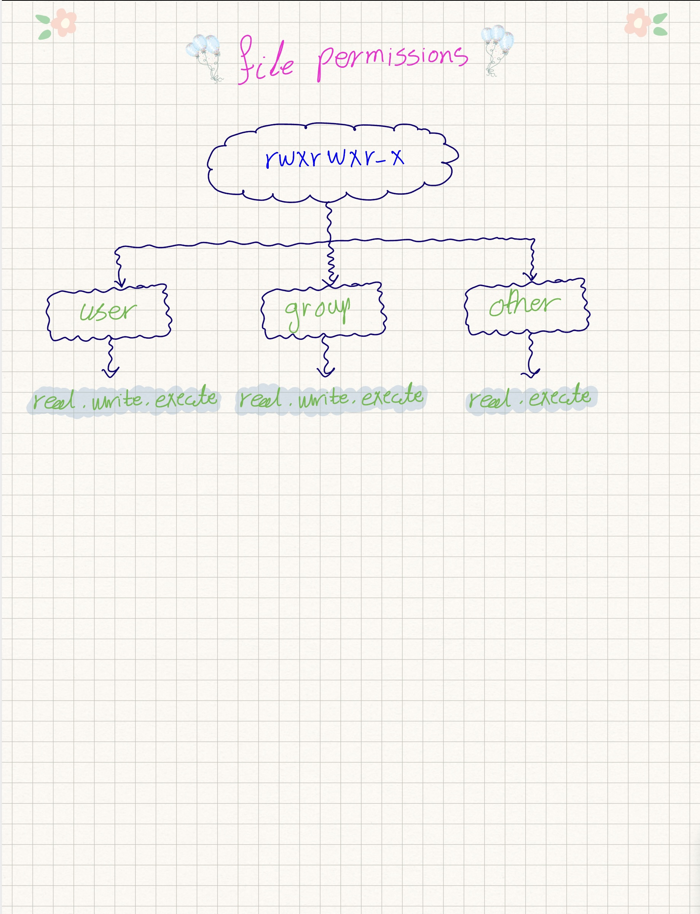
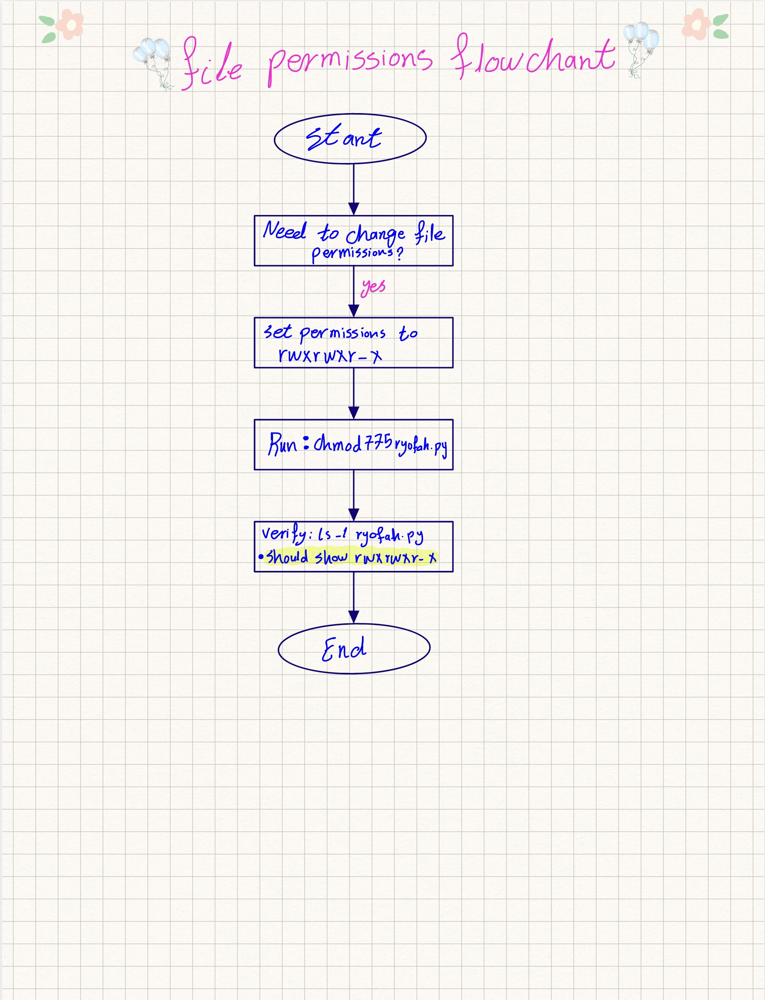
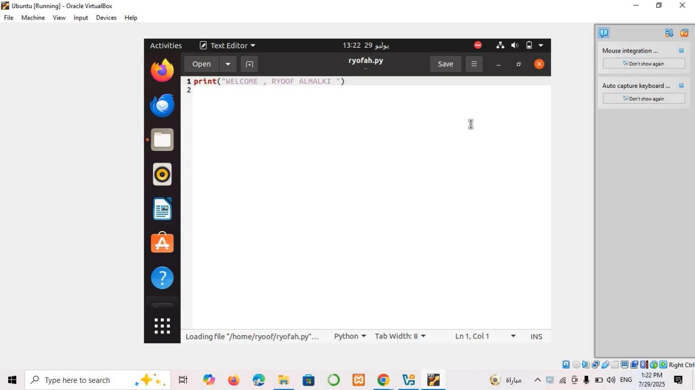
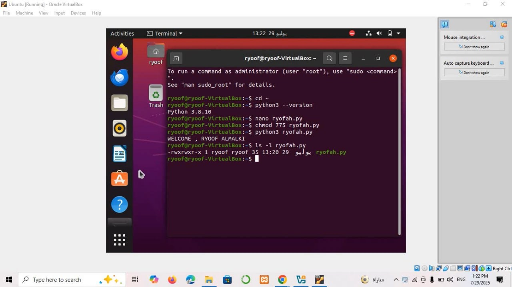

# 🌻 Linux File Permissions Using chmod and Python – Task 4 🌻
 ---
 
## ✨🪄 Overview ✨🪄
This task demonstrates how to manage file permissions in Linux using the `chmod` command. The objective was to understand permission types (read, write, execute) for user, group, and others, and to apply this by assigning the permission `rwxrwxr-x` to a Python file.

---

## ✨🪄 Steps ✨🪄
1. Launch Ubuntu inside the VirtualBox.
2. Create a simple Python file `ryofah.py`.
3. Use the command `chmod 775 ryofah.py` to change its permissions.
4. Run `ls -l ryofah.py` to verify the result shows `rwxrwxr-x`.

--- 

## ✨🪄 Flowchart & Concepts ✨🪄

### File Permission Breakdown:

### Flowchart:

### Python File Creation:

### chmod Execution:

 ---
 

## 🌻 Created by 🌻
🪄 ** Ryoof Dukhailallah Almalki**🪄
